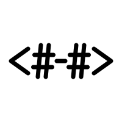

<div align="center">
  
  <h1>WaterUI</h1>
  <p>A Rust UI framework that renders through real native widgets.</p>
  <p>
    <a href="https://crates.io/crates/waterui"></a>
    <a href="https://docs.rs/waterui"></a>
    <a href="https://github.com/water-rs/waterui/blob/main/LICENSE-MIT"></a>
    <a href="https://codecov.io/gh/water-rs/waterui"></a>
  </p>
</div>

WaterUI is a cross-platform UI framework for Rust. You write views once, and each backend maps them onto whatever the platform actually uses: UIKit and AppKit on Apple, Android Views on Android, GTK4 on Linux. Where no native toolkit fits there are two self-drawn renderers: Hydrolysis draws on the GPU through Vello, and Dew is a CPU renderer frugal enough for microcontrollers.

State is plain values. Put mutable state in a `Binding`, derive from it with `Computed`, and hand those to views. When a value changes, the views that read it update. There is no virtual tree to diff, and changing one string never rebuilds the subtree around it.

## Getting started

```bash
cargo install waterui-cli
water create counter --mode playground
cd counter
water run
```

A playground is a plain Rust crate; the CLI keeps native projects out of your source tree and manages them on demand. `src/lib.rs` looks like this:

```rust,ignore
use waterui::app::App;
use waterui::prelude::*;
use waterui::preview;

#[preview]
fn main() -> impl View {
    let count = Binding::i32(0);

    vstack((
        text("Hello, WaterUI!").size(28),
        text!("Count: {count}"),
        stepper("Count", &count),
    ))
    .padding()
}

pub fn app(env: Environment) -> App {
    App::new(main, env)
}
```

That's the whole entry point. The app crate depends on `waterui` and nothing else; FFI glue and backend projects are generated and owned by the CLI.

`water run` targets the current host by default. To run somewhere else:

```bash
water run --platform ios
water run --platform android
water run --platform linux
```

`water doctor` tells you what's missing from a toolchain, and `water devices` lists simulators and connected devices.

## Previews

Any function marked `#[preview]` can be rendered to an image without launching the app:

```bash
water preview main --output preview.png
water preview main --frame 800x600 --output preview.png
```

The same surface drives `water preview test` for semantic interaction tests and `water preview perf` for GPU measurements.

## Shipping a real app

Playgrounds are for iteration. App mode generates platform projects that belong to you, so they can be customized, signed, and packaged:

```bash
water create my-app --backends apple,android
cd my-app
water run --platform ios
```

`Water.toml` holds package metadata, enabled backends, permissions, and theming. Add or remove a backend later with `water backend`.

To give the app an icon, drop a square `Icon.svg` or `Icon.png` into `assets/`. The CLI renders every platform format from that one file: full-bleed squares for iOS, the rounded-rect shape for macOS, and adaptive icon layers for Android, so the artwork survives each platform's mask. New projects start with the WaterUI logo there until you replace it.

## State

`Binding<T>` is mutable state, `Computed<T>` is derived state. Signal-aware APIs take either, and only their readers update:

```rust
use waterui::prelude::slider::slider;
use waterui::prelude::*;

fn progress_editor() -> impl View {
    let value = Binding::f64(0.25);
    let percent = value.map(|value| value * 100.0);

    vstack((
        slider("Progress", &value).range(0.0..=1.0),
        text!("Progress: {percent:.0}%"),
    ))
}
```

Collections work the same way. Give `List` or `ForEach` a reactive collection of `Identifiable` items and membership changes are diffed by id:

```rust
use waterui::prelude::*;
use waterui::Identifiable;

#[derive(Clone, Identifiable)]
struct Contact {
    #[id]
    id: u64,
    name: &'static str,
}

fn contacts() -> impl View {
    let contacts = [
        Contact { id: 1, name: "Alice Chen" },
        Contact { id: 2, name: "Bob Smith" },
    ];

    List::for_each(contacts, |contact| ListItem::new(text(contact.name)))
}
```

One thing to know early: `watch` replaces the subtree it wraps, losing any state inside it. It exists for intentional structural swaps. For routine updates, pass signals into components and let the framework do the precise thing.

## Backends

| Target | Backend | Renders through |
| --- | --- | --- |
| iOS and macOS | Apple | UIKit / AppKit |
| Android | Android | Android Views |
| Linux | GTK4 | GTK4 widgets |
| macOS, Linux, Windows, web | Hydrolysis | Self-drawn, GPU (Vello) |
| ESP32-S3 / ESP32-C3 | Dew | Self-drawn, CPU, dirty-region |

A self-drawn renderer is a deliberate choice of backend, never a silent fallback. If a native bridge fails, that's a bug to fix, not a reason to swap renderers at runtime.

## Status

Pre-1.0. The API still moves, and we break it on purpose when a better shape is found. Apple and Android backends are the most complete; Hydrolysis is close behind; GTK4 and Dew are younger. If you hit a wall, an issue with a small reproduction is genuinely useful.

## Examples

- [Gallery](examples/gallery/) — broad component showcase
- [Form](examples/form/) — derived forms and reactive field projection
- [Navigation](examples/navigation/) — stacks, tabs, and navigation state
- [Flow Markdown](examples/flow_markdown/) — streaming Markdown rendering
- [Map](examples/map/) — map component across platform realizations
- [Video player](examples/video_player/) — playback state and controls
- [Filter](examples/filter/) — GPU image filters

To run one from a checkout:

```bash
cargo install --path cli
cd examples/gallery
water run --platform macos
```

## Repository layout

- [`core/`](core/) — `View`, `Environment`, layout contracts, reactive integration
- [`components/`](components/) — layouts, text, controls, forms, navigation, media, charts, and friends
- [`backends/`](backends/) — Apple, Android, GTK4, Hydrolysis, Dew
- [`cli/`](cli/) — the `water` command and project generators
- [`ffi/`](ffi/) — the C ABI backends talk through
- [`testing/`](testing/) — semantic UI testing over the accessibility tree
- [`examples/`](examples/) — runnable applications

## Documentation

- [API reference](https://docs.rs/waterui)
- [WaterUI book](https://book.waterui.dev)
- [CLI guide](cli/README.md)
- [Roadmap](docs/ROADMAP.md)

## Contributing

Target the `dev` branch; `main` is for releases. For anything substantial, open an issue first so the design can be discussed before you sink time into it. AI-assisted contributions are welcome as long as a human understands and reviews the result; fully autonomous pull requests are not accepted.

## License

MIT or Apache 2.0, at your option. See [LICENSE-MIT](LICENSE-MIT) and [LICENSE-APACHE](LICENSE-APACHE).
